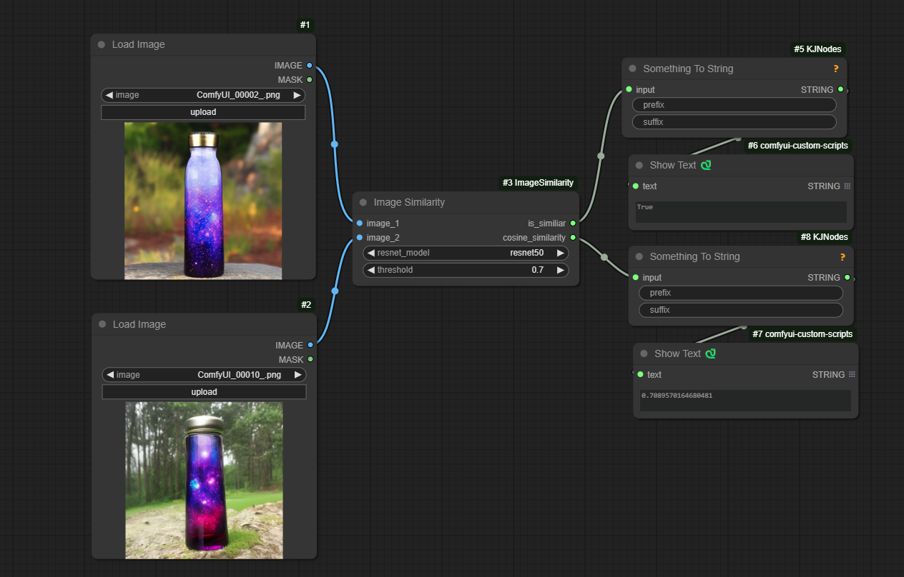
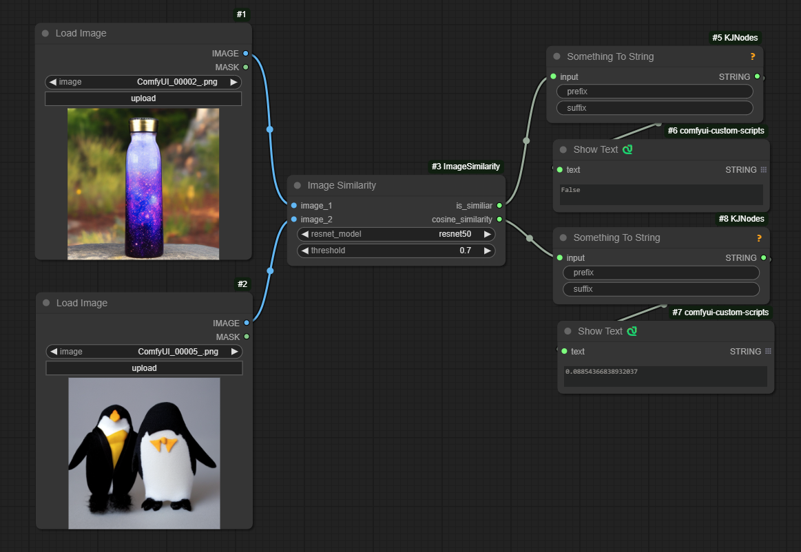

# ComfyUI Image Similarity Node

A custom node for ComfyUI that compares two images using ResNet embeddings and cosine similarity.

## Description

This node allows you to compare two images and determine their visual similarity using deep learning features extracted from ResNet models. It outputs both a boolean indicating if the images are similar (based on a threshold) and the actual cosine similarity score.

## Features

- Supports multiple ResNet architectures (ResNet18, ResNet34, ResNet50, ResNet101, ResNet152)
- Configurable similarity threshold
- Returns both boolean similarity result and cosine similarity score
- GPU acceleration when available

## Installation

1. Create a `custom_nodes` folder in your ComfyUI installation directory if it doesn't exist
2. Clone this repository into the `custom_nodes` folder:
```bash
cd custom_nodes
git clone [repository-url]
```

## Usage

The node takes the following inputs:

- **image_1**: First image to compare
- **image_2**: Second image to compare  
- **resnet_model**: Choice of ResNet architecture (default: resnet50)
- **threshold**: Similarity threshold between 0.0 and 1.0 (default: 0.70)

Outputs:

- **is_similar**: Boolean indicating if similarity is above threshold
- **cosine_similarity**: Float value between -1 and 1 indicating similarity score

## How it Works

1. Images are preprocessed and resized to match ResNet input requirements
2. A pre-trained ResNet model extracts feature embeddings from both images
3. Cosine similarity is calculated between the embeddings
4. Returns both the raw similarity score and a thresholded boolean result

## Example Workflow

[Add screenshot/example of the node being used in ComfyUI]

## Examples


*Screenshot of Example Workflow*


*Screenshot of Example Workflow*

## License

MIT License

Copyright (c) 2025 Norman Gosset

Permission is hereby granted, free of charge, to any person obtaining a copy
of this software and associated documentation files (the "Software"), to deal
in the Software without restriction, including without limitation the rights
to use, copy, modify, merge, publish, distribute, sublicense, and/or sell
copies of the Software, and to permit persons to whom the Software is
furnished to do so, subject to the following conditions:

The above copyright notice and this permission notice shall be included in all
copies or substantial portions of the Software.

THE SOFTWARE IS PROVIDED "AS IS", WITHOUT WARRANTY OF ANY KIND, EXPRESS OR
IMPLIED, INCLUDING BUT NOT LIMITED TO THE WARRANTIES OF MERCHANTABILITY,
FITNESS FOR A PARTICULAR PURPOSE AND NONINFRINGEMENT. IN NO EVENT SHALL THE
AUTHORS OR COPYRIGHT HOLDERS BE LIABLE FOR ANY CLAIM, DAMAGES OR OTHER
LIABILITY, WHETHER IN AN ACTION OF CONTRACT, TORT OR OTHERWISE, ARISING FROM,
OUT OF OR IN CONNECTION WITH THE SOFTWARE OR THE USE OR OTHER DEALINGS IN THE
SOFTWARE.